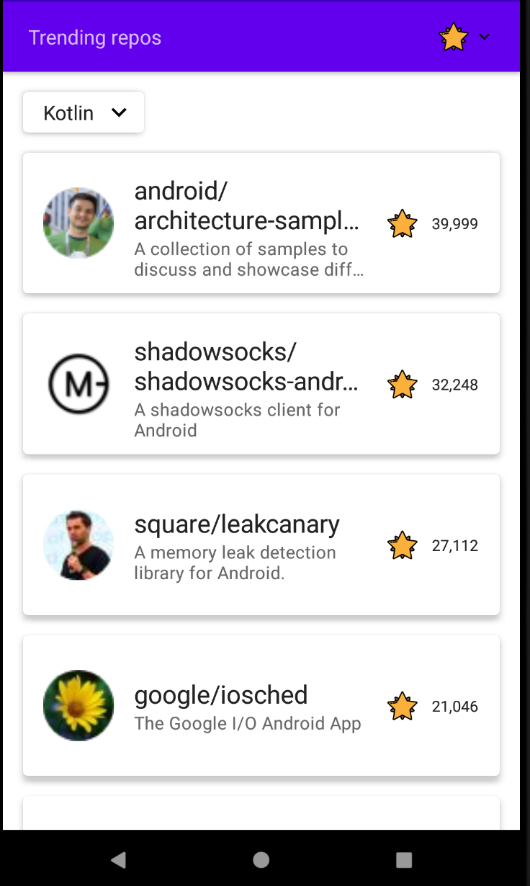

# Trending Repos - Compose MVVM

Trending Repos is a sample project that presents a modern approach to Android app development.

The app uses [this endpoint](https://github.com/xxdongs/github-trending) to obtain trending repositories.

## Features
* A List screen where trending repositories are displayed.
    * You can select a programming language to filter repositories by.
    * You can sort repositories by their star count, ascending or descending from the AppBar.
* A Details screen of the previously selected repository.
* Full support for recovering from System-initiated Process death by using the SavedStateHandle API.
* Offline support - everything is cached.
* Support for different width dimensions and densities by using Compose Weights API for composables functions.
* UI and Unit tests.

## Tech stack

* UI
   * [Compose](https://developer.android.com/jetpack/compose) declarative UI framework
   * [Material design](https://material.io/design)

* Tech/Tools
    * [Kotlin](https://kotlinlang.org/) 100% coverage
    * [Coroutines](https://kotlinlang.org/docs/reference/coroutines-overview.html) for async operations
    * [Hilt](https://developer.android.com/training/dependency-injection/hilt-android) for Dependency Injection
    * [Jetpack](https://developer.android.com/jetpack)
        * [Compose](https://developer.android.com/jetpack/compose)
        * [Navigation](https://developer.android.com/topic/libraries/architecture/navigation/) for navigation between composables
        * [ViewModel](https://developer.android.com/topic/libraries/architecture/viewmodel) that stores, exposes and manages UI state
        * [Room](https://developer.android.com/training/data-storage/room) for local caching
    * [Retrofit](https://square.github.io/retrofit/) for networking
    * [Coil](https://github.com/coil-kt/coil) for image loading

* Architecture
    * Single activity architecture (with [Navigation component](https://developer.android.com/guide/navigation/navigation-getting-started)) that defines a navigation graph
    * MVVM with local source (Room) as SSOT for content.
    * [Android Architecture components](https://developer.android.com/topic/libraries/architecture) ([ViewModel](https://developer.android.com/topic/libraries/architecture/viewmodel), [Navigation](https://developer.android.com/jetpack/androidx/releases/navigation))

## Notes:
* The API didn't provide me with unique identifiers for repository items so I constructed them from the url of each repository. I needed an unique ID to retrieve specific repositories from Room in scenarios like: online, offline or upon process death.